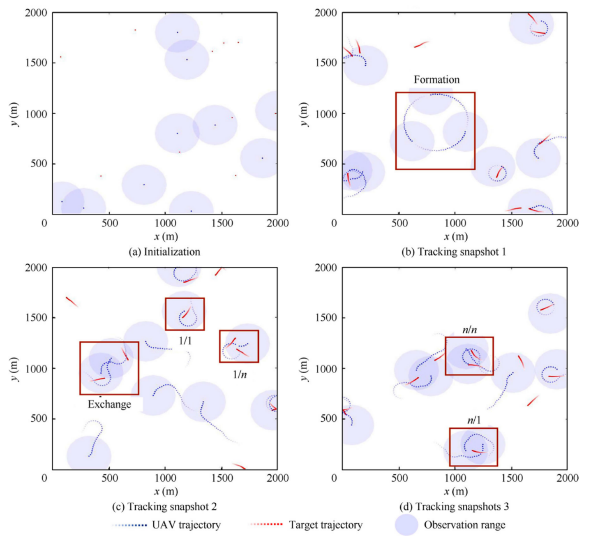

# MARL-UAVs-Targets-Tracking

本仓库复现并改进论文《Improving multi-target cooperative tracking guidance for UAV swarms using multi-agent reinforcement learning》中提出的多无人机多目标协同跟踪方法，提供原始 MAAC、互惠奖励 MAAC-R、全局奖励 MAAC-G 以及基线 C-METHOD 等多种策略实现。



## 项目简介

- **研究背景**：利用多智能体强化学习（Multi-Agent Reinforcement Learning, MARL）提升无人机编队在复杂环境中的协同跟踪能力。
- **主要思路**：在共享 Actor-Critic 权重的前提下，引入 PMI 网络估计无人机之间的互信息，结合局部奖励与协同奖励，实现更稳定的协作策略。
- **交付内容**：训练脚本、评估脚本、可视化工具、结果管理与配置文件，方便复现与扩展。

## 功能亮点

- 支持 MAAC、MAAC-R、MAAC-G 与传统 C-METHOD 多种策略切换。
- 采用可配置的 Actor-Critic 框架，提供经验回放与优先经验回放缓冲区实现。
- 集成 PMI 网络，动态建模无人机之间的协作权重。
- 自动保存模型权重、运行曲线、动画视频与关键统计指标。

## 环境要求

- Python 3.9+
- CUDA 可选（建议安装对应版本的 PyTorch）

### 安装依赖

```powershell
python -m venv .venv
.venv\Scripts\activate
pip install --upgrade pip
pip install torch torchvision torchaudio --index-url https://download.pytorch.org/whl/cu118
pip install numpy matplotlib tqdm tensorboard scipy imageio[ffmpeg] Pillow pyyaml
```

> 如需离线安装 `pip`，可使用仓库根目录的 `get-pip.py`。

## 快速开始

### 训练（默认使用 MAAC-R）

```powershell
python src/main.py --phase train --method MAAC-R --num_episodes 10000 --num_steps 200
```

- `--method`：选择策略（`MAAC`、`MAAC-R`、`MAAC-G`、`C-METHOD`）。
- `--phase`：执行阶段（`train` 训练、`evaluate` 评估、`run` 无强化学习基线策略）。
- `--frequency`：指标打印与模型保存的间隔（默认 100）。
- 可通过 `--actor_path`、`--critic_path`、`--pmi_path` 指定已有权重进行继续训练或评估。

### 评估与生成可视化

```powershell
python src/main.py --phase evaluate --method MAAC-R --num_steps 200 --actor_path <path> --critic_path <path> --pmi_path <path>
```

### 仅运行 C-METHOD 基线

```powershell
python src/main.py --phase run --method C-METHOD --num_steps 200
```

## 配置文件

`src/configs/*.yaml` 定义超参数，可根据需求复制修改：

- `C-METHOD.yaml`：基于规则的协同方法。
- `MAAC.yaml`：无协同奖励的基础 MAAC。
- `MAAC-G.yaml`：全局奖励版本。
- `MAAC-R.yaml`：互惠奖励（默认）。

关键字段说明：

- `environment`：无人机数量、目标数量、地图尺寸、动作空间维度。
- `uav` / `target`：运动学参数、感知范围、奖励权重。
- `actor_critic`：经验缓冲区大小、学习率、折扣因子等。
- `pmi`：PMI 网络结构与训练批次设置。
- `result_dir`：对应方法的输出目录。

## 结果输出

每次运行会在 `results/<METHOD>/<exp_name_timestamp_pid>/` 生成完整的实验快照：

- `actor/`, `critic/`, `pmi/`：保存 ckpt 权重。
- `animated/`：保存轨迹动画 MP4。
- `frames/`（运行结束后自动清理单帧 PNG）。
- `t_xy/`, `u_xy/`：目标与无人机轨迹 CSV。
- `covered_target_num/`：覆盖数量曲线 CSV。
- 根目录若干 PNG：奖励与惩罚随时间变化曲线。
- `args.yaml`: 运行时所有配置的完整快照。
- 多个 `*.csv`：累计奖励、跟踪奖励、边界惩罚等指标。

## 目录与文件说明

| 路径 | 说明 |
| --- | --- |
| `.idea/` | PyCharm 等 IDE 生成的工程配置，可忽略。 |
| `imgs/` | 示例图片（`2d-demo.png` 展示二维跟踪效果）。 |
| `results/` | 所有实验输出按方法分类存放。 |
| `src/` | 项目核心源代码。 |
| `src/main.py` | 命令行入口：解析参数、加载配置、构造环境与智能体，调用训练/评估/基线流程。 |
| `src/train.py` | 训练与评估管线：包含 `train/evaluate/run` 函数、经验回放（含优先经验回放）、日志写入、可视化触发等。 |
| `src/environment.py` | 自定义环境：管理无人机/目标状态、交互逻辑、奖励计算、轨迹记录与数据导出。 |
| `src/agent/uav.py` | 无人机智能体：感知邻近目标与队友、Actor-Critic 动作选择、奖励拆分、协同奖励（PMI / 均值）、基线策略。 |
| `src/agent/target.py` | 目标模型：随机机动、边界反弹逻辑。 |
| `src/models/actor_critic.py` | 策略网络与价值网络实现（包含残差结构、保存/加载接口）。 |
| `src/models/PMINet.py` | PMI 网络：估计智能体间互信息，提供自定义损失、训练循环与推理接口。 |
| `src/utils/args_util.py` | 配置解析工具：加载 YAML、设置随机种子、创建输出目录、配置计算设备。 |
| `src/utils/data_util.py` | 数据工具：奖励裁剪/归一化、CSV 导出。 |
| `src/utils/draw_util.py` | 可视化工具：绘制奖励曲线、生成轨迹动画并压缩为 MP4。 |
| `src/configs/` | 各策略的超参数配置文件（见上文）。 |
| `get-pip.py` | 官方 `pip` 安装脚本，供无网络环境使用。 |
| `README.md` | 项目说明文档（本文件）。 |

> `__pycache__` 等缓存目录来自 Python 编译，可随时清理。

## 进一步扩展建议

- 更换 `configs` 中的场景规模或奖励权重，探索大规模 UAV 协同表现。
- 引入自定义网络结构（可在 `models/` 中添加新模型并在 `main.py` 中接入）。
- 将 `results` 目录接入 TensorBoard / WandB，实现更细致的训练监控。

欢迎提交 Issue 或 Pull Request 一起完善该项目。
